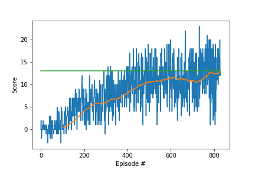
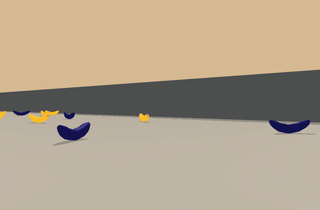
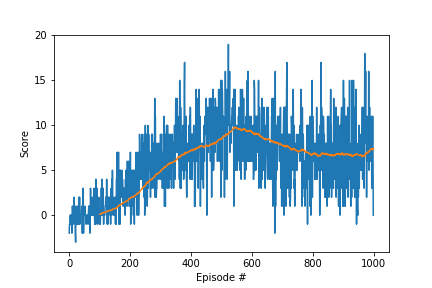

#Navigation Project Submission Report

## Summary

For this project, I implemented a vanilla Deep Q-Learning algorithm to solve the given Banana environment in around 900 episodes. 
The Q-Network used was simply fully connected.

Although I experimented with prioritized replay, I did not find it necessary to solve this submission, so the main part only describes the vanilla version.  


## Software Structure

### How to run

#### Training 
In order to train the agent, please run ```Navigation.ipynb```. This notebook will
1. Setup the unity environment
2. Setup the agent with used hyperparameters
3. Train the agent and show the trained rewards
4. Run 1 episode with the trained agent in normal speed

#### Inference
In order to run the already trained agent, please run ```RunModel.ipynb```

### Replay Memory
All functionality related to replay memory is implemented in ```ExperienceReplayBuffer.py```. 
The file contains two classes:
- ```ExperienceReplayBuffer``` that implements a simple replay buffer that keeps the last N experiences in a queue
- ```PrioritizedReplayBuffer``` extends the functionality to also keep track of the last weight/priority of a given experience in order to sample more important experiences more often

Both classes adhere to the same interface, so it can be used interchangeable in the rest of the training code

In order to test and play with both replay memories, ```testReplayBuffer.py``` is a test script to call the relevant functions before testing them in the combined training

### QNetwork 
```QNetwork.py``` contains the class ```QNetwork``` that represents the learned Q function mapping the states as inputs to expected rewards for taking each possible action

### DQNAgent
```DQNAgent.py``` contains the code to train the QNetwork. It implements a standard Deep Q-Learning algorithm with a fixed Q-Target network that updates slower than the primary Q-Network.

The ```Agent``` class is not aware of the structure of the Model and/or the memory, so different implementations can be plugged in on construction. 

## Chosen QNetwork structure
As the state (37) and action (4) space are both relatively small, I decided to use a fully connected layers with 2 hidden layers with 200 and 100 neurons.
Fortunately with this setup, I was able to train the agent successfully without the need to revisit the neuron counts.

## Chosen Hyperparameters for training

| Parameter     | Value         |   Description                                                         | 
| ------------- |:-------------:| ----------------------------------------------------------------------| 
| learning_rate | 5e-4          | Hyperparameter for model weight updates                               | 
| batch_size    | 64            | The number of samples taken each training step from the replay memory |
| memory_size   | 10000         | The total number of last experiences kept in replay memory            | 
| gamma         | 0.99          | Discount factor of the reward function                                |
| update_every  | 4             | How often is the target network updating the policy network           | 
| tau           | 1e-3          | Controls the rate how fast                                             |

## Results

With the described model structure and hyperparameters, 
the agent was able to solve (score>13 in 100 episodes) the environment in less than 900 episodes:

```Environment solved in 830 episodes!	Average Score: 13.00```


Here is a gif of the resulting policy:


The trained model weights are saved in model.pth

### Observed Problems of the Policy:
Sometimes, the policy gets stuck alternating between two actions and not making any rewards anymore. 
The completely greedy policy cannot recover from these errors
 


## Future Improvements

#### Experimentation with the epsilon-greedy Policy
As seen in the previous part, sometimes the policy gets stuck in local minima.
It would be interesting to explore different ways to change the epsilon parameter during training to balance between exploitation and exploration.


#### Prioritized Replay
In the scope of the project, I also experimented with "Prioritized Replay" 
from [here](https://arxiv.org/pdf/1511.05952.pdf).

Although the paper shows, that the convergence rate is higher (up to 2x faster in their benchmark), 
I could not reproduce this for the training task at hand with my implementation:

After reaching an average reward of roughly 8, the training stagnated and the agent started to perform worse like shown here:




I identified the following things that need to checked/addressed: 
- I did not try annealing of $$\beta$$ or changing of $$\alpha$$ in any way within the training process. As these parameter control how aggressive high-prioriy experiences are chosen and weighted, these could be the reason for the lack of learning in late stages.
- Although I checked, that the implementation is able to sample experiences with high TD error more often, I am not completely sure about the implementation of the importance sampling weight that is used in the gradient for updating the QNetwork weights.
- Maybe other hyperparameters like the batch size or network size need to be adjusted  

#### Duelling Networks
As described by https://arxiv.org/abs/1511.06581, duelling networks separate the estimate of the state value and the value of each action.
Thus dueling network architectures can learn which states are worth to reach and it does not necessarily have learn the value of each action in this state correctly.

#### Double DQNs
As described by https://arxiv.org/abs/1509.06461, double DQNs try to overcome problems with overconfidence of one network in an action, by having two networks to calculate the Q-Value:

The first network choses through argmax its best action and the second network gives the corresponding Q-value for determening the TD error. 
As both networks need to agree what the best action is to give a high Q value, this overcomes problems with overconfidence.
As a second network, one could reuse the target network from DQN as its different enough to from the primary network to improve results.
 